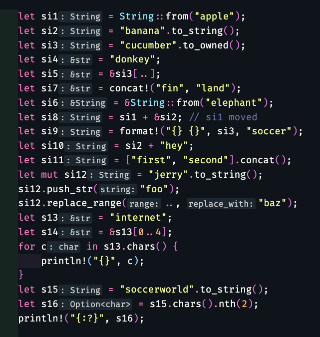

## Strings & &str



## Structs

```
// unit struct
struct FileDirectory;

//  struct
struct Color(u8, u8, u8);

// named struct
struct Person {
        name: String,
        age: u32,
}
```

## Options

Some(x), None

## Results

Ok(x), Err(e)

## Operations

unwrap(); // causes panic if fail
expects(msg); // causes panic if fail
? // get the result if operation success, get error if fail
.ok().or(err); // convert Option to Result;
if let Some(x); // only care about single Variant Result and doesn't care about None

## Collections

Arrays // [u8, 1024]
Vectors // Vec<i32>
HashMaps // HashMap<i32, i32>

```
        let vvv1 = vec![String::from("Andie"), String::from("James"), String::from("Keith")];

	let mut hmm1 = HashMap::new();

        for v in &vvv1 {
            hmm1.insert(v, 1000);
        }

        println!("{:?}", hmm1[&"Keith".to_string()]);
        println!("{:?}", hmm1.get(&"Keith".to_string()));
```

BTreeMaps // BTreeMap<i32, i32> Very Similar to HashMaps except in order

## Iterators

iter() // to consult
iter_mut() // to modify
into_iter() // to consume

loop {};
while {};
(1..=10).collect();
for c in a_string.chars();
for c in a.iter().enumerate();
a.iter().map(|x| ...); // iter, into_iter()
a.iter_mut().for_each(|x| ...) // iter_mut()
let aa = a.iter() ... aa.next();

## Traits

```
stream: &mut dyn Write // dynamic dispatch: There will be runtime costs so slower as it needs to resolve the concrete type at RUN TIME

stream: &mut impl Write // static dispatch: its faster as concrete type is resolved at COMPILE TIME

// Using Generics instead of impl Traits
function prints_it<T: Display + Into<String>>(input: T ) {
println!("You can print it {}", input);
}

// Using impl Traits instead of Generics
function prints_it(input: impl Display + Into<String>) {
println!("You can print it {}", input);
}

// () -> impl Trait; return a Closure
FnOnce - uses what is passed in and drops it (destroys it)
FnMut - it can modify it
Fn - can take by reference (generally choose this)
function returns_a_closure(input: &str) -> impl FnMut(i32) -> i32 {
        match input {
                "double" => |mut number| {
                        number *= 2;
                        println!("Double number is: {}", number);
                        number
                },
                "triple" => |mut number| {
                        number *= 3;
                        println!("Triple number is: {}", number);
                        number
                },
                _ => |number| {
                        println!("Sorry, I only understand double or triple {}", number);
                        number
                }
        }

}

```

## Closures

```
fn change<F>(&mut self, f: F)
where F: Fn(&mut Self) {
        f(self);
};

fn city_data<F>(&mut self, mut f: F)
where F: FnMut(&mut Vec<u32>, &mut Vec<u32>) {
        f(&mut self.years, &mut self.populations);
}
```

## Threads

### Cells & RefCells

### Mutexes

### RwLocks

## Modules

mod, use, use crate::, use super::

## Libraries

std::net
std::io
std::fmt
std::convert
std::str
std::collections
std::error
std::num
std::cell
std::sync

## Miscellaneous

as_ref(); // &Option<T> becomes Option<&T>

todo!();
unimplemented!();
